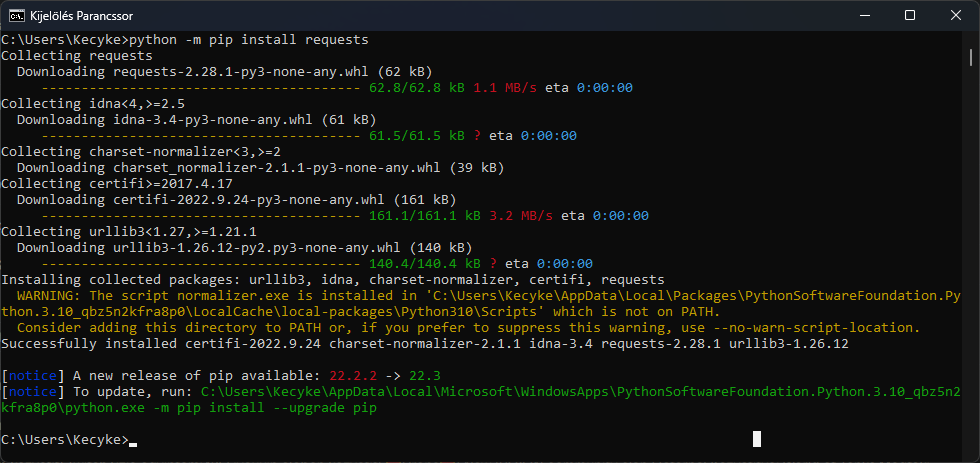

### Requests API telepítése
--------------------------

A program futtatásához szükséges a Python 3.10 és a requests API.
Az előző Linuxon alapból telepítve van, Windowson, ha letöltjük a Visual Studio Code alkalmazást, akkor ott telepíthetjük a Python 3.10 fordítót.

Ha van python a gépünkön, de nincs requests API, írjuk be az alábbi parancsot:

```bash
python -m pip install requests
```

