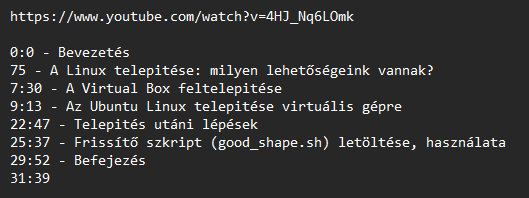

### Requests API telepítése
--------------------------

A program futtatásához szükséges a Python 3.10 és a requests API.
Az előző Linuxon alapból telepítve van, Windowson, ha letöltjük a Visual Studio Code alkalmazást vagy megkeressük a Microsoft Store webáruházban, akkor ott telepíthetjük a Python 3.10 fordítót.

Ha van python a gépünkön, de nincs requests API, írjuk be az alábbi parancsot:

```bash
python -m pip install requests
```


### Program használata
-------------------

Lépések:
1. Nyissuk meg a bemenet.txt fájlt
2. Első sorba írjuk be a youtube videó linkjét, majd hagyjunk ki egy sort
3. Második sortól írjuk be, hogy melyik *perc*:*másodperc* pontnál kezdődik egy adott fejezet, majd szóköz-kötőjel-szóköz karaktereket téve írjuk be a rész címét (pl.: 22:47 - Telepités utáni lépések)
   - Sem a percnek, sem a másodpercnek nem kell kétjegyű számnak lennie
   - Nem kell a 60-as váltószámot betartani
   - a címben lehet 

Példa:



4. Indítsuk el a timestamp.py fájlt.